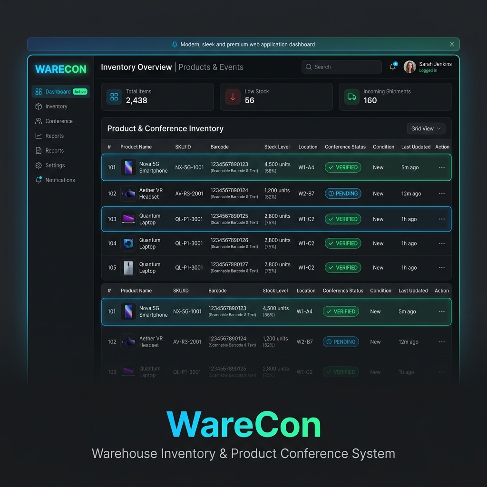

  <h1>🚀 Portfólio de Engenharia de Software - Shadowlkj</h1>
  
Bem-vindo ao meu portfólio oficial! Aqui você encontra uma vitrine dos principais sistemas corporativos, robôs de automação e aplicações web que desenvolvi.

---

## 1. 🛒 Site Lojas Ditudo - E-commerce & Logística
Um sistema web completo e robusto desenvolvido para centralizar operações logísticas, compras e portal do fornecedor de uma rede de lojas de utilidades domésticas.

### 📸 Visão Geral

  

### 📌 Principais Funções & Como Funciona
*   **Portal do Fornecedor Autônomo:** Os próprios fornecedores da empresa acessam o site para realizar o agendamento de suas entregas de forma totalmente automatizada.
*   **Robô de Notificações (WhatsApp Bot):** Uma inteligência artificial integrada ao painel administrativo que envia mensagens instantâneas e automáticas via WhatsApp para motoristas e gerentes sobre o status das cargas.
*   **Painel Administrativo:** Gestão em tempo real das docas e recebimentos nas filiais (Itapevi, Jandira, Osasco, etc).

### 🛠️ Arquitetura Técnica
*   **Backend:** Java (Spring Boot)
*   **Frontend:** HTML5, CSS3, JavaScript
*   **Banco de Dados:** MySQL / MariaDB
*   **Integração:** API de WhatsApp desenvolvida em Node.js (`whatsapp-web.js`)

---

## 2. 🧾 Calculadora de Nota Fiscal Automática (Uso Corporativo)
Uma ferramenta financeira focada na automação do cálculo complexo de impostos (com ênfase em ICMS-ST e Difal) para notas fiscais de entrada.

### 📸 Visão Geral

  

### 📌 Principais Funções & Como Funciona
*   **Leitura Mágica de XML:** O usuário simplesmente faz o upload do arquivo XML enviado pelo fornecedor. O sistema varre o código, extrai todas as tags relevantes (NCM, IPI, ICMS) e desenha a nota inteira na tela instantaneamente.
*   **Motor de Auto-aprendizado (ST e Difal):** A calculadora cruza a MVA com o ICMS de origem e a Alíquota Interna de SP para calcular a Substituição Tributária exata. Se o produto não tiver ST, o sistema aciona a regra do Difal. Tudo isso com um "banco de dados invisível" que memoriza as regras digitadas para aquele NCM para uso futuro!
*   **Importação de Excel de Preços:** Puxa os custos antigos via planilha XLSX para comparação imediata com os impostos novos da mercadoria.
*   **Privacidade Máxima:** Roda 100% offline no computador do usuário corporativo, sem enviar dados fiscais para a internet.

### 🛠️ Arquitetura Técnica
*   **Tecnologias:** Vanilla JavaScript, HTML5, CSS3
*   **Parsers:** Algoritmo proprietário de extração DOM XML e integração `SheetJS`.

---

## 3. 📦 Programa de Conferência de Estoque (Arius)
Um aplicativo de auditoria de estoque ultraleve voltado para a conferência de divergências logísticas, otimizado para as regras do Sistema ERP Arius.

### 📸 Visão Geral

  

### 📌 Principais Funções & Como Funciona
*   **Auditor de Divergências:** Ferramenta que compara arquivos gigantescos de coletores de dados (`EAN;VALOR`), identificando instantaneamente itens faltantes ou que vieram na quantidade errada do centro de distribuição.
*   **Motor Matemático Invisível:** Realiza conversões de unidades de forma autônoma (como divisões massivas por 10.000 para bater com o layout de leitura do ERP).
*   **Exportador Rápido:** Após a auditoria, entrega um arquivo de texto higienizado pronto para ser subido e faturado.

### 🛠️ Arquitetura Técnica
*   **Tecnologias:** Interface construída em Web Technologies e processadores nativos em Python (`inspect_xlsx`).

---

## 4. 🌐 Calculadora de NF-e (Projeto Open Source / Template)
Uma versão genérica, segura e obfoscada da ferramenta de cálculo tributário (Projeto 2), disponibilizada ao público.

### 📌 Principais Funções & Como Funciona
*   **Distribuição Inteligente:** Entregue através de um instalador `.bat` autônomo que cria pastas do sistema e gera atalhos sem necessidade de permissões de administrador.
*   **Blindagem de Código (Obfuscação):** Para proteger a propriedade intelectual das fórmulas de ST e Difal, todo o código do motor de cálculo foi codificado em criptografia Base64. A ferramenta funciona perfeitamente, mas a "fórmula secreta" fica ilegível para a concorrência.
*   **Template Multi-loja:** O sistema trabalha com identidades dinâmicas ("LTDA" e "ME") para adaptar as isenções de Difal dependendo do regime tributário selecionado no momento da conferência.

### 🛠️ Links e Acesso
*   *Nota: Por questões de segurança, os códigos-fontes dos projetos privados não estão listados. O projeto Open Source pode ser baixado e executado por instalador próprio.*

---

  <i>Desenvolvido com 💚 e Engenharia de Ponta.</i>

